# Software Requirements Specification (SRS)
## for Platform LOKAL  
**Platform Digital Berbasis Mobile untuk Optimalisasi Sirkulasi Ekonomi Lokal**

| Atribut | Nilai |
|---|---|
| Versi Dokumen | 1.1.0 — April 2026 |
| Status | Draft Akhir |
| Dibuat oleh | Tim Pengembang Platform LOKAL |
| Organisasi | Platform LOKAL — Bandung, Jawa Barat, Indonesia |
| Tanggal Dibuat | April 2026 |
| Klasifikasi | Internal — Dokumen Perancangan |
| Database | MySQL 8.0 |

---

## Revision History

| Name | Date | Reason For Changes | Version |
|---|---|---|---|
| Tim Pengembang LOKAL | April 2026 | Dokumen Teknis v1.1 dirilis | 1.1.0 |

---

# 1. Introduction

## 1.1 Purpose
Dokumen SRS ini mendefinisikan kebutuhan perangkat lunak Platform LOKAL v1.1.0 — aplikasi mobile ekosistem ekonomi digital tertutup (*closed-loop*) untuk mengoptimalkan sirkulasi ekonomi lokal di Kota Bandung dan sekitarnya. Dokumen ini mencakup kebutuhan fungsional, non-fungsional, antarmuka eksternal, dan arsitektur sistem sebagai acuan bagi tim developer, QA, manajer proyek, dan pemangku kepentingan.

## 1.2 Document Conventions
Dokumen mengikuti standar **IEEE 830-1998**. Prioritas ditandai: **Tinggi / Sedang / Rendah**.  
Kode fungsional: **F-XX**; non-fungsional: **NF-XX**. Istilah teknis didefinisikan di **Appendix A**.

## 1.3 Intended Audience and Reading Suggestions
- **Developer Backend/Frontend/Mobile:** Bab 3, 4, dan 5  
- **Tim QA/Tester:** Bab 4 (test case) dan Bab 5 (pengujian performa)  
- **Manajer Proyek:** Bab 1, 2, dan Bab 4 (scope dan prioritas)  
- **Pemangku Kepentingan Bisnis:** Bab 1 dan 2  
- **Arsitek Sistem:** Bab 3, 4, dan Appendix B  

## 1.4 Product Scope
Platform LOKAL adalah aplikasi mobile (Android & iOS) yang menghubungkan konsumen dengan UMKM lokal menggunakan peta interaktif, sistem insentif token **Lokal Coin**, dan analitik pasar berbasis ML.  
Tujuan utama: mengurangi kebocoran ekonomi lokal, memberi akses digital bagi UMKM, dan membangun ekosistem ekonomi komunitas berkelanjutan.  
Fase pilot: Kota Bandung, Kab. Bandung, Kab. Bandung Barat, dan Kota Cimahi.

## 1.5 References
- Dokumen Teknis Sistem LOKAL v1.1.0 — April 2025.  
- IEEE Std 830-1998: Recommended Practice for Software Requirements Specifications.  
- UU No. 27 Tahun 2022 tentang Pelindungan Data Pribadi (UU PDP).  
- Regulasi OJK dan Bank Indonesia terkait sistem pembayaran digital.  
- Midtrans API Docs — `https://docs.midtrans.com`  
- Laravel 11 — `https://laravel.com/docs/11.x`  
- Flutter 3.19 — `https://docs.flutter.dev`  

---

# 2. Overall Description

## 2.1 Product Perspective
Platform LOKAL adalah produk baru (bukan pengganti sistem lama) berupa marketplace berbasis lokasi yang menghubungkan penjual UMKM dan pembeli dalam ekosistem tertutup.  
Bukan lembaga keuangan — seluruh transaksi melalui **Midtrans**.  

Komponen utama:
- Mobile App (Flutter)
- API Backend (Laravel 11)
- ML Service (Python/FastAPI)
- n8n Workflow Engine
- MySQL 8.0
- layanan eksternal: Midtrans, Twilio, Google Maps API

## 2.2 Product Functions
- **Autentikasi & Manajemen Pengguna:** Registrasi multi-peran, login OTP SMS, JWT RS256.
- **Peta Pasar & Katalog Produk:** Peta interaktif UMKM radius 0.5–10 km, CRUD produk, filter multi-kriteria.
- **Transaksi & Pembayaran:** Keranjang multi-UMKM, checkout via Midtrans (GoPay, OVO, DANA, VA, QRIS).
- **Lokal Coin & Insentif:** Reward 2% per transaksi, diskon maks. 20%, kadaluwarsa 6 bulan.
- **Rekomendasi Harga ML:** Analisis harga pasar lokal asinkron via Python/FastAPI.
- **Dashboard Analitik UMKM:** Grafik penjualan, produk terlaris, pendapatan bersih, real-time.
- **Notifikasi & Otomasi:** Push notification dan SMS otomatis via n8n untuk event transaksi.

## 2.3 User Classes and Characteristics
- **Konsumen:** Pembeli produk UMKM lokal; pengguna smartphone awam, frekuensi harian–mingguan.
- **UMKM/Penjual:** Pelaku usaha dengan kapasitas teknis terbatas; wajib terverifikasi NIB/SIUP.
- **Produsen:** Supplier/produsen grosir dalam ekosistem; karakteristik serupa UMKM.
- **Administrator (Internal):** Tim LOKAL, mengakses panel admin terpisah (di luar cakupan SRS ini).

## 2.4 Operating Environment
- **Mobile:** Android min. API 24 (7.0) & iOS min. 14.0; Flutter 3.19 + Riverpod + Dio.
- **Backend:** VPS Indonesia, Ubuntu 22.04, 8 vCPU, 16 GB RAM; PHP 8.3/Laravel 11 via Docker.
- **Database & Cache:** MySQL 8.0 + Redis 7.2-alpine; Object Storage: MinIO (S3-compatible).
- **Koneksi:** Internet aktif min. 3G/HSPA; data pengguna di server wilayah Indonesia (UU PDP).

## 2.5 Design and Implementation Constraints
- **Regulasi UU PDP:** Data pribadi wajib disimpan di server dalam wilayah Indonesia.
- **Regulasi OJK/BI:** Transaksi keuangan hanya melalui payment gateway berizin (Midtrans).
- **Lokal Coin** tidak dapat dikonversi ke fiat; maks. 20% dari nilai transaksi; hangus setelah 6 bulan.
- Teknologi wajib: Flutter, Laravel 11/PHP 8.3, MySQL 8.0, Docker.
- API response time maks. 500ms untuk endpoint kritikal; kapasitas pilot: 10.000 concurrent users.

## 2.6 User Documentation
- Panduan Pengguna Konsumen (in-app): Onboarding interaktif, tutorial Peta Pasar & Lokal Coin.
- Panduan Pengguna UMKM (in-app + PDF): Tutorial manajemen produk dan dashboard.
- FAQ In-App & Pusat Bantuan Online.
- TBD: Video tutorial onboarding UMKM (v1.2.0).

## 2.7 Assumptions and Dependencies
- **Asumsi:** Pengguna memiliki smartphone kompatibel & internet aktif; UMKM bersedia mengunggah NIB/SIUP.
- **Dependensi eksternal:** Midtrans (pembayaran), Twilio SMS Gateway (OTP), Google Maps Platform (peta), Docker Hub (container registry), GitHub Actions (CI/CD).

---

# 3. External Interface Requirements

## 3.1 User Interfaces
- Navigasi: Bottom navigation bar 5 tab (Beranda, Peta Pasar, Keranjang, Dompet, Profil).
- Peta Interaktif: Google Maps SDK; marker UMKM dengan info window; filter radius 0.5–10 km.
- Checkout Flow: 3 langkah — Keranjang > Konfirmasi & Pembayaran > Status Pesanan.
- Dashboard UMKM: Line chart & bar chart penjualan, kartu ringkasan metrik.
- Responsivitas & Aksesibilitas: Mendukung 360–480dp (portrait) & tablet 600dp+; WCAG 2.1 level AA.

## 3.2 Hardware Interfaces
- GPS/Lokasi: Akurasi min. 50 meter; izin lokasi saat aplikasi digunakan.
- Kamera & Penyimpanan: Untuk unggah foto produk UMKM (izin kamera & galeri).
- Push Notification: FCM (Android) & APNs (iOS).
- Koneksi Internet: Min. 3G/HSPA; mode offline terbatas (riwayat transaksi dari cache lokal).

## 3.3 Software Interfaces
- **Midtrans:** SNAP API + webhook SHA-512; format JSON/HTTPS.
- **Twilio SMS:** OTP 6 digit; timeout 5 menit (disimpan di Redis).
- **Google Maps Platform:** Maps SDK + Geocoding API + Distance Matrix API.
- **ML Service (internal):** FastAPI Python 3.11 + scikit-learn; endpoint `http://ml-service:8000/api/price-recommendation` (asinkron).
- **n8n:** Self-hosted workflow automation; trigger HTTP webhook dari Laravel.
- **MinIO:** Object storage S3-compatible untuk foto produk & dokumen legalitas UMKM.

## 3.4 Communications Interfaces
- Protokol: HTTPS/TLS 1.2 min. (TLS 1.3 direkomendasikan); REST API format JSON.
- Base URL API: `https://api.lokal.id/v1`; autentikasi Bearer Token JWT RS256.
- Rate Limiting: OTP/login 5 req/menit per IP; endpoint umum 100 req/menit per token.
- Push Notification: FCM/APNs; tidak menggunakan WebSocket pada versi MVP.

---

# 4. System Features

Platform LOKAL memiliki 7 fitur sistem utama:

| Kode | Fitur | Deskripsi Singkat | Prioritas |
|---|---|---|---|
| F-01 | Autentikasi & Pengguna | Registrasi multi-peran, login OTP SMS, JWT, verifikasi UMKM | Tinggi |
| F-02 | Peta Pasar & Produk | Peta interaktif UMKM radius 0.5–10 km, CRUD katalog produk | Tinggi |
| F-03 | Transaksi & Pembayaran | Keranjang multi-UMKM, checkout Midtrans (GoPay/OVO/DANA/VA/QRIS) | Tinggi |
| F-04 | Lokal Coin & Insentif | Reward 2%/transaksi, diskon maks. 20%, kadaluwarsa 6 bulan | Sedang |
| F-05 | Rekomendasi Harga ML | Analisis harga produk serupa radius 5 km secara asinkron | Sedang |
| F-06 | Dashboard Analitik UMKM | Grafik penjualan, produk terlaris, pendapatan bersih, real-time | Tinggi |
| F-07 | Notifikasi & Otomasi | Push notification & SMS via n8n untuk event transaksi | Tinggi |

---

## 4.1 F-01: Autentikasi & Pengguna

### 4.1.1 Description and Priority
Mengelola identitas pengguna via OTP nomor telepon.  
**Prioritas:** TINGGI.

### 4.1.2 Functional Requirements
- **REQ-F01-01:** Registrasi tiga peran — Konsumen, UMKM, Produsen.
- **REQ-F01-02:** OTP 6 digit terkirim dalam maks. 30 detik; berlaku 5 menit (Redis TTL 300 detik).
- **REQ-F01-03:** Maks. 5 percobaan OTP salah sebelum nomor diblokir 15 menit.
- **REQ-F01-04:** JWT RS256; access token 24 jam, refresh token 30 hari.
- **REQ-F01-05:** Akun UMKM baru wajib verifikasi dokumen NIB/SIUP oleh admin sebelum berjualan.
- **REQ-F01-06:** Pengguna baru otomatis mendapat 50 Lokal Coin saat aktivasi akun.

---

## 4.2 F-02: Peta Pasar & Produk

### 4.2.1 Description and Priority
Fitur inti: peta interaktif UMKM terdekat dan katalog produk.  
**Prioritas:** TINGGI.

### 4.2.2 Functional Requirements
- **REQ-F02-01:** Peta interaktif Google Maps SDK; marker setiap UMKM aktif dalam radius yang ditentukan.
- **REQ-F02-02:** Radius pencarian 0.5–10 km; default 5 km.
- **REQ-F02-03:** Pencarian produk berdasarkan nama, kategori, harga, jarak, dan rating.
- **REQ-F02-04:** CRUD produk oleh UMKM; maks. 5 foto per produk (maks. 2 MB/foto).
- **REQ-F02-05:** Pagination produk default 20 item/halaman; koordinat disimpan tipe POINT MySQL.

---

## 4.3 F-03: Transaksi & Pembayaran

### 4.3.1 Description and Priority
Mengelola seluruh alur transaksi dari pemilihan produk hingga konfirmasi.  
**Prioritas:** TINGGI.

### 4.3.2 Functional Requirements
- **REQ-F03-01:** Keranjang belanja multi-UMKM; validasi stok saat checkout.
- **REQ-F03-02:** Pembayaran via GoPay, OVO, DANA, VA Bank, QRIS melalui Midtrans.
- **REQ-F03-03:** Link/QR pembayaran kadaluwarsa 30 menit; webhook Midtrans divalidasi SHA-512.
- **REQ-F03-04:** Riwayat transaksi lengkap dengan filter tanggal & status; mendukung alur refund.

---

## 4.4 F-04: Lokal Coin & Insentif

### 4.4.1 Functional Requirements
- **REQ-F04-01:** Kredit otomatis 2% nilai transaksi saat status 'completed'; 5 koin per ulasan valid.
- **REQ-F04-02:** Maks. 20% nilai transaksi dapat dibayar dengan Lokal Coin; tidak bisa dikonversi ke fiat.
- **REQ-F04-03:** Koin hangus otomatis setelah 6 bulan; notifikasi 30 hari sebelum kadaluwarsa.
- **REQ-F04-04:** Setiap transaksi koin tercatat di riwayat dompet.

---

## 4.5 F-05: Rekomendasi Harga ML

### 4.5.1 Functional Requirements
- **REQ-F05-01:** Rekomendasi asinkron saat UMKM tambah produk baru; analisis radius 5 km.
- **REQ-F05-02:** Respons mencakup harga saran, rentang harga, dan jumlah produk serupa yang dianalisis.
- **REQ-F05-03:** Respons maks. 3 detik; graceful degradation jika ML Service tidak tersedia.

---

## 4.6 F-06: Dashboard Analitik UMKM

### 4.6.1 Functional Requirements
- **REQ-F06-01:** Grafik penjualan harian/mingguan/bulanan; data diperbarui maks. 5 menit setelah transaksi.
- **REQ-F06-02:** Menampilkan total pendapatan, pertumbuhan %, jumlah order, produk terlaris, rating, pelanggan baru.
- **REQ-F06-03:** Filter rentang tanggal kustom; hanya diakses akun UMKM terverifikasi (Bearer+UMKM role).

---

## 4.7 F-07: Notifikasi & Otomasi

### 4.7.1 Functional Requirements
- **REQ-F07-01:** Notifikasi konfirmasi pesanan (konsumen & UMKM), pembayaran berhasil/gagal, update status pengiriman.
- **REQ-F07-02:** Notifikasi peringatan stok menipis (< 10 unit) kepada UMKM.
- **REQ-F07-03:** Pengguna dapat mengatur preferensi notifikasi; semua alur diimplementasikan via n8n.

---

# 5. Other Nonfunctional Requirements

| Kategori | Persyaratan | Target |
|---|---|---|
| Performa | Waktu respons API endpoint kritikal | < 500ms |
| Performa | Waktu respons ML Service | < 3 detik |
| Skalabilitas | Pengguna konkuren fase pilot | 10.000 concurrent |
| Ketersediaan | Uptime sistem produksi | >= 99.5%/bulan |
| Keamanan | Enkripsi client-server | HTTPS/TLS 1.2+ |
| Keamanan | Enkripsi data sensitif di DB | AES-256 |
| Privasi | Lokasi penyimpanan data | Server Indonesia (UU PDP) |
| Portabilitas | Platform mobile | Android API 24+ & iOS 14+ |
| Pemeliharaan | Deployment & rollback | Zero-downtime (Docker+Watchtower) |
| Kegunaan | Waktu onboarding pengguna baru | <= 5 menit |

## 5.1 Performance Requirements
- **NF-PERF-01:** API kritikal (autentikasi, peta, checkout) maks. 500ms pada 1.000 concurrent request.
- **NF-PERF-02:** ML Service maks. 3 detik; graceful degradation jika melebihi batas.
- **NF-PERF-03:** Render peta 100+ marker UMKM < 2 detik di perangkat kelas menengah.
- **NF-PERF-04:** Query geospasial produk < 200ms menggunakan indeks SPATIAL MySQL.

## 5.2 Safety Requirements
- **NF-SAFE-01:** Rollback otomatis jika pembayaran gagal; stok tidak dikurangi saat order pending.
- **NF-SAFE-02:** Audit log immutable untuk seluruh transaksi keuangan dan perubahan status order.
- **NF-SAFE-03:** Idempotency untuk webhook Midtrans guna mencegah double processing.

## 5.3 Security Requirements
- **NF-SEC-01:** HTTPS/TLS 1.2+ untuk semua komunikasi client-server.
- **NF-SEC-02:** JWT RS256; disimpan di Android Keystore / iOS Keychain.
- **NF-SEC-03:** Rate limiting ketat pada endpoint OTP (5/menit per IP).
- **NF-SEC-04:** Data sensitif (nomor HP, alamat) dienkripsi AES-256 di database.
- **NF-SEC-05:** Mematuhi UU PDP; data pengguna tersimpan di server Indonesia; proteksi OWASP Top 10.

## 5.4 Software Quality Attributes
- **Availability:** Uptime >= 99.5%/bulan; maintenance terjadwal 00.00–04.00 WIB.
- **Maintainability:** PSR-12 coding standard; OpenAPI 3.0 docs; CI/CD GitHub Actions.
- **Portability:** Docker container; dapat berpindah ke cloud provider manapun.
- **Reliability:** Backup otomatis harian; Redis untuk session & cache.
- **Testability:** Unit test coverage min. 80%; Postman Collection untuk integration testing.

## 5.5 Business Rules
- **BR-01:** Lokal Coin hanya berlaku sebagai diskon dalam ekosistem LOKAL; tidak dapat dikonversi ke fiat.
- **BR-02:** Maks. 20% nilai transaksi dibayar dengan Lokal Coin; hangus setelah 6 bulan tidak digunakan.
- **BR-03:** Hanya UMKM terverifikasi yang dapat berjualan; semua transaksi melalui Midtrans berizin OJK.
- **BR-04:** Platform berperan sebagai marketplace (bukan lembaga keuangan).

---

# 6. Other Requirements
- **Database:** MySQL 8.0; tipe POINT untuk koordinat UMKM; JSON untuk atribut produk variabel; backup otomatis pukul 02.00 WIB, retensi 30 hari.
- **Internationalization:** MVP dalam Bahasa Indonesia; multi-bahasa (Inggris, Sunda) direncanakan v2.0; mata uang IDR.
- **Legal:** Mematuhi UU PDP No. 27/2022; regulasi OJK/BI; Syarat & Ketentuan + Kebijakan Privasi disetujui saat registrasi; data tidak digunakan untuk iklan pihak ketiga tanpa persetujuan.
- **Reuse:** Modul autentikasi JWT & koin sebagai reusable Laravel package; ML model dapat dilatih ulang per wilayah; n8n workflow templates dapat diimpor.

---

# Appendix A: Glossary

| Istilah | Definisi |
|---|---|
| UMKM | Usaha Mikro, Kecil, dan Menengah — target utama platform LOKAL. |
| Lokal Coin | Token reward internal; diperoleh dari transaksi & ulasan; diskon maks. 20%; tidak bisa dicairkan. |
| Closed-loop Economy | Ekosistem ekonomi tertutup di mana nilai berputar dalam komunitas lokal. |
| OTP | Kode verifikasi 6 digit, berlaku 5 menit, dikirim via SMS. |
| JWT | JSON Web Token berbasis RFC 7519; digunakan autentikasi setiap request API. |
| Midtrans | Payment gateway Indonesia berizin BI/OJK (GoPay, OVO, DANA, VA, QRIS). |
| QRIS | Quick Response Code Indonesian Standard — standar QR pembayaran nasional BI. |
| n8n | Platform workflow automation open-source untuk orkestrasi notifikasi & distribusi koin. |
| UU PDP | UU No. 27 Tahun 2022 tentang Pelindungan Data Pribadi. |
| OJK | Otoritas Jasa Keuangan — pengawas sektor jasa keuangan Indonesia. |
| MVP | Minimum Viable Product — versi produk dengan fitur minimum untuk diuji pengguna awal. |
| TBD | To Be Determined — informasi yang belum tersedia saat penulisan dokumen. |

---

# Appendix B: Analysis Models

## B.1 API Endpoint Summary
**Base URL:** `https://api.lokal.id/v1`

| Method | Endpoint | Deskripsi | Auth |
|---|---|---|---|
| POST | /auth/request-otp | Kirim OTP ke nomor HP | Publik |
| POST | /auth/verify-otp | Verifikasi OTP & dapatkan JWT | Publik |
| POST | /auth/refresh | Refresh access token | Publik |
| DELETE | /auth/logout | Invalidasi token aktif | Bearer |
| GET/PATCH | /users/me | Ambil / perbarui profil pengguna | Bearer |
| GET | /products | Daftar produk dengan filter lokasi | Bearer |
| POST | /products | Tambah produk baru (UMKM) | Bearer+UMKM |
| GET/PATCH/DELETE | /products/{id} | Detail / update / hapus produk | Bearer/Bearer+UMKM |
| GET | /umkm/nearby | Daftar UMKM terdekat untuk peta | Bearer |
| POST | /orders | Buat pesanan dari keranjang | Bearer |
| GET | /orders | Riwayat pesanan pengguna | Bearer |
| PATCH | /orders/{id}/status | Update status pesanan (UMKM) | Bearer+UMKM |
| POST | /orders/{id}/review | Berikan ulasan produk | Bearer |
| GET | /wallet/balance | Saldo & ringkasan Lokal Coin | Bearer |
| GET | /wallet/history | Riwayat transaksi Lokal Coin | Bearer |
| GET | /umkm/analytics/summary | Ringkasan performa penjualan | Bearer+UMKM |
| GET/PATCH | /notifications | Daftar / tandai baca notifikasi | Bearer |

## B.2 Arsitektur Komponen
- **Client Layer:** Flutter 3.19 (Android API 24+ & iOS 14+) — modul Auth, Market Map, Checkout, Wallet, Dashboard.
- **API Gateway Layer:** Nginx 1.25 — reverse proxy, SSL termination, rate limiting.
- **Backend Layer:** Laravel 11 API + n8n Workflow Engine + ML Service (Python/FastAPI).
- **Data Layer:** MySQL 8.0 + Redis 7.2 + MinIO Object Storage.
- **External Services:** Midtrans, Twilio SMS, Google Maps Platform.

---
# Rancangan Database
# 🗄️ Database Schema — Platform LOKAL v1.1.0

> **Platform Digital Berbasis Mobile untuk Optimalisasi Sirkulasi Ekonomi Lokal**  
> Bandung, Jawa Barat, Indonesia · April 2025

---

## 📋 Ringkasan

| Item | Keterangan |
|------|-----------|
| **Database** | MySQL 8.0 |
| **Total Tabel** | 18 tabel |
| **Views** | 2 (`v_active_products`, `v_wallet_summary`) |
| **Stored Procedures** | 2 (`sp_earn_lokal_coin`, `sp_spend_lokal_coin`) |
| **Charset** | utf8mb4 / utf8mb4_unicode_ci |
| **Versi Dokumen** | v1.1.0 |

---

## 🗂️ Daftar Tabel

| No | Tabel | Modul | Keterangan |
|----|-------|-------|-----------|
| 1 | `users` | F-01 Auth | Semua pengguna: konsumen, UMKM, produsen, admin |
| 2 | `otp_codes` | F-01 Auth | Audit trail OTP SMS via Twilio |
| 3 | `refresh_tokens` | F-01 Auth | JWT RS256 refresh token |
| 4 | `umkm_profiles` | F-01 & F-02 | Profil bisnis UMKM; koordinat `POINT` + `SPATIAL INDEX` |
| 5 | `categories` | F-02 Produk | Hierarki kategori produk (parent-child) |
| 6 | `products` | F-02 Produk | Katalog produk; `FULLTEXT` + `JSON` atribut |
| 7 | `carts` | F-03 Transaksi | Keranjang belanja (1 per user) |
| 8 | `cart_items` | F-03 Transaksi | Item keranjang multi-UMKM |
| 9 | `orders` | F-03 Transaksi | Header pesanan + integrasi Midtrans |
| 10 | `order_items` | F-03 Transaksi | Detail item per UMKM dalam satu order |
| 11 | `payment_logs` | F-03 Transaksi | Audit log webhook Midtrans (SHA-512) |
| 12 | `wallets` | F-04 Lokal Coin | Dompet Lokal Coin per pengguna |
| 13 | `wallet_transactions` | F-04 Lokal Coin | Ledger koin (append-only; hangus 6 bulan) |
| 14 | `reviews` | F-04 Lokal Coin | Ulasan produk; reward 5 koin |
| 15 | `notifications` | F-07 Notifikasi | Notifikasi in-app via FCM/APNs + n8n |
| 16 | `ml_price_recommendations` | F-05 ML | Rekomendasi harga asinkron Python/FastAPI |
| 17 | `audit_logs` | Keamanan | Log immutable event keuangan & status |
| 18 | `analytics_daily` | F-06 Analitik | Agregat harian dashboard UMKM |

---

## 📊 Entity Relationship Diagram

```mermaid
---
title: Database Schema — Platform LOKAL v1.1.0
---
erDiagram

  users {
    BIGINT      id              PK
    VARCHAR     name
    VARBINARY   phone           "AES-256 encrypted"
    VARCHAR     phone_hash      "SHA-256 untuk pencarian"
    ENUM        role            "consumer|umkm|producer|admin"
    ENUM        status          "active|inactive|blocked|pending_verification"
    VARCHAR     fcm_token
    JSON        notification_pref
    TIMESTAMP   created_at
    TIMESTAMP   deleted_at      "Soft delete"
  }

  otp_codes {
    BIGINT      id              PK
    VARCHAR     phone_hash      FK
    VARCHAR     otp_hash        "SHA-256 kode OTP"
    TINYINT     attempt         "Maks. 5 percobaan"
    TIMESTAMP   expires_at      "TTL 5 menit"
    TIMESTAMP   blocked_until   "Blokir 15 menit"
    TIMESTAMP   created_at
  }

  refresh_tokens {
    BIGINT      id              PK
    BIGINT      user_id         FK
    VARCHAR     token_hash
    TIMESTAMP   expires_at      "30 hari"
    TIMESTAMP   revoked_at
    TIMESTAMP   created_at
  }

  umkm_profiles {
    BIGINT      id              PK
    BIGINT      user_id         FK
    VARCHAR     business_name
    TEXT        address
    POINT       location        "SPATIAL INDEX — radius query"
    VARCHAR     nib_number
    VARCHAR     siup_number
    ENUM        verification_status "pending|verified|rejected"
    DECIMAL     rating_avg
    INT         rating_count
    TINYINT     is_active
    TIMESTAMP   created_at
  }

  categories {
    INT         id              PK
    INT         parent_id       FK "NULL = root"
    VARCHAR     name
    VARCHAR     slug
    TINYINT     is_active
    TIMESTAMP   created_at
  }

  products {
    BIGINT      id              PK
    BIGINT      umkm_id         FK
    INT         category_id     FK
    VARCHAR     name
    DECIMAL     price
    DECIMAL     price_min       "Saran ML minimum"
    DECIMAL     price_max       "Saran ML maksimum"
    INT         stock
    JSON        photos          "Array URL MinIO, maks. 5"
    JSON        attributes      "Variabel: warna, ukuran, dll."
    TINYINT     is_active
    TIMESTAMP   deleted_at      "Soft delete"
  }

  carts {
    BIGINT      id              PK
    BIGINT      user_id         FK "1 keranjang per user"
    TIMESTAMP   updated_at
  }

  cart_items {
    BIGINT      id              PK
    BIGINT      cart_id         FK
    BIGINT      product_id      FK
    INT         quantity
    DECIMAL     price_snapshot  "Harga saat ditambahkan"
    TIMESTAMP   updated_at
  }

  orders {
    BIGINT      id              PK
    VARCHAR     order_number    "ORD-YYYYMMDD-XXXXXX"
    BIGINT      user_id         FK
    ENUM        status          "pending|paid|processing|shipped|completed|cancelled|refunded"
    DECIMAL     subtotal
    DECIMAL     lokal_coin_used "Maks. 20% subtotal"
    DECIMAL     total_amount    "Jumlah bayar ke Midtrans"
    ENUM        payment_method  "gopay|ovo|dana|virtual_account|qris"
    VARCHAR     midtrans_order_id
    TIMESTAMP   payment_expires_at "Kadaluwarsa 30 menit"
    TIMESTAMP   paid_at
    TIMESTAMP   created_at
  }

  order_items {
    BIGINT      id              PK
    BIGINT      order_id        FK
    BIGINT      umkm_id         FK
    BIGINT      product_id      FK
    VARCHAR     product_name    "Snapshot nama produk"
    INT         quantity
    DECIMAL     unit_price
    DECIMAL     subtotal
    ENUM        umkm_status     "pending|accepted|rejected|shipped|delivered"
    TIMESTAMP   updated_at
  }

  payment_logs {
    BIGINT      id              PK
    BIGINT      order_id        FK
    VARCHAR     midtrans_order_id
    VARCHAR     transaction_id
    VARCHAR     event_type
    VARCHAR     transaction_status
    JSON        payload         "Raw webhook Midtrans"
    TINYINT     signature_valid "Validasi SHA-512"
    TIMESTAMP   processed_at
  }

  wallets {
    BIGINT      id              PK
    BIGINT      user_id         FK "1 dompet per user"
    DECIMAL     balance         "Saldo Lokal Coin aktif"
    DECIMAL     lifetime_earned
    TIMESTAMP   updated_at
  }

  wallet_transactions {
    BIGINT      id              PK
    BIGINT      wallet_id       FK
    ENUM        type            "earn|spend|expire|bonus|adjustment"
    DECIMAL     amount          "Positif masuk, negatif keluar"
    DECIMAL     balance_before
    DECIMAL     balance_after
    VARCHAR     reference_type  "orders|reviews|system"
    BIGINT      reference_id
    TIMESTAMP   expires_at      "Hangus 6 bulan"
    TIMESTAMP   created_at
  }

  reviews {
    BIGINT      id              PK
    BIGINT      order_item_id   FK
    BIGINT      user_id         FK
    BIGINT      product_id      FK
    BIGINT      umkm_id         FK
    TINYINT     rating          "1-5"
    TEXT        comment
    TINYINT     coin_rewarded   "1 = sudah dapat 5 koin"
    TIMESTAMP   created_at
  }

  notifications {
    BIGINT      id              PK
    BIGINT      user_id         FK
    VARCHAR     type            "order_confirmed|payment_success|stock_low|coin_expiry"
    VARCHAR     title
    TEXT        body
    JSON        data
    TINYINT     is_read
    TIMESTAMP   created_at
  }

  ml_price_recommendations {
    BIGINT      id              PK
    BIGINT      product_id      FK
    DECIMAL     recommended_price
    DECIMAL     price_min
    DECIMAL     price_max
    INT         sample_count    "Radius 5 km"
    VARCHAR     model_version
    TIMESTAMP   analyzed_at
  }

  audit_logs {
    BIGINT      id              PK
    BIGINT      actor_id        "NULL = system"
    VARCHAR     action
    VARCHAR     entity_type
    BIGINT      entity_id
    JSON        old_value
    JSON        new_value
    TIMESTAMP   created_at
  }

  analytics_daily {
    BIGINT      id              PK
    BIGINT      umkm_id         FK
    DATE        date
    INT         total_orders
    DECIMAL     gross_revenue
    DECIMAL     net_revenue
    INT         new_customers
    TIMESTAMP   updated_at
  }

  users                  ||--o{ refresh_tokens            : "memiliki"
  users                  ||--o| umkm_profiles             : "mendaftar sebagai"
  users                  ||--o| carts                     : "punya keranjang"
  users                  ||--o{ orders                    : "membuat pesanan"
  users                  ||--o{ reviews                   : "menulis ulasan"
  users                  ||--o{ notifications             : "menerima notifikasi"
  users                  ||--o| wallets                   : "punya dompet"

  categories             ||--o{ categories                : "sub-kategori"
  categories             ||--o{ products                  : "mengelompokkan"

  umkm_profiles          ||--o{ products                  : "menjual produk"
  umkm_profiles          ||--o{ order_items               : "menerima order"
  umkm_profiles          ||--o{ analytics_daily           : "data analitik"

  products               ||--o{ cart_items                : "masuk keranjang"
  products               ||--o{ order_items               : "tercatat di order"
  products               ||--o{ reviews                   : "dinilai konsumen"
  products               ||--o{ ml_price_recommendations  : "dianalisis ML"

  carts                  ||--o{ cart_items                : "berisi item"

  orders                 ||--o{ order_items               : "berisi item"
  orders                 ||--o{ payment_logs              : "log pembayaran"

  order_items            ||--o| reviews                   : "diulas konsumen"

  wallets                ||--o{ wallet_transactions       : "mencatat transaksi koin"
```



---

## 🔑 Catatan Teknis Penting

### Keamanan Data
- Kolom `phone` dan `phone_business` dienkripsi **AES-256** di layer aplikasi (Laravel)
- Pencarian nomor HP menggunakan `phone_hash` (SHA-256) untuk efisiensi tanpa membuka enkripsi
- Validasi webhook Midtrans menggunakan **SHA-512** dicatat di `payment_logs.signature_valid`
- `audit_logs` bersifat **INSERT-ONLY** — tidak boleh ada `UPDATE` atau `DELETE` (NF-SAFE-02)

### Geospasial (Peta Pasar)
- Koordinat UMKM disimpan sebagai tipe `POINT` MySQL 8.0 dengan `SPATIAL INDEX`
- Query radius menggunakan `ST_Distance_Sphere`:

```sql
SELECT *, ST_Distance_Sphere(
  location,
  ST_GeomFromText('POINT(107.6191 -6.9175)')
) AS dist_m
FROM umkm_profiles
WHERE ST_MBRContains(
  ST_Buffer(ST_GeomFromText('POINT(107.6191 -6.9175)', 4326), 5000/111320),
  location
)
AND verification_status = 'verified'
AND is_active = 1
ORDER BY dist_m
LIMIT 50;
```

### Lokal Coin (F-04)
- **Tidak bisa dikonversi ke fiat** (BR-01)
- Maksimum **20%** nilai transaksi dibayar dengan Lokal Coin (BR-02)
- Koin **hangus otomatis setelah 6 bulan** dari tanggal diperoleh (REQ-F04-03)
- Notifikasi peringatan 30 hari sebelum kadaluwarsa
- Reward: **2%** nilai transaksi saat `completed` + **5 koin** per ulasan valid

### Transaksi & Idempotency
- `orders.midtrans_order_id` memiliki `UNIQUE KEY` untuk mencegah double processing
- `payment_logs` menyimpan seluruh raw payload webhook Midtrans untuk audit trail
- Stok **tidak dikurangi** saat status order masih `pending` (NF-SAFE-01)

---

## 📁 File dalam Repositori Ini

| File | Keterangan |
|------|-----------|
| `lokal_database_schema.sql` | Schema lengkap siap import ke MySQL 8.0 |
| `lokal_database_erd.mermaid` | File ERD Mermaid standalone |
| `README.md` | Dokumentasi ini |

---

## 🚀 Cara Import Schema

```bash
# Import ke MySQL
mysql -u root -p lokal_platform < lokal_database_schema.sql

# Atau buat database terlebih dahulu
mysql -u root -p -e "CREATE DATABASE lokal_platform CHARACTER SET utf8mb4 COLLATE utf8mb4_unicode_ci;"
mysql -u root -p lokal_platform < lokal_database_schema.sql
```

---


# Appendix C: To Be Determined List

| No. | Item TBD | Target Resolusi |
|---|---|---|
| TBD-01 | Integrasi API logistik pihak ketiga (JNE, SiCepat, AnterAja) | Sprint 3 — Mei 2025 |
| TBD-02 | Video tutorial onboarding UMKM | v1.2.0 — Q3 2025 |
| TBD-03 | Dukungan multi-bahasa (Inggris, Sunda) | v2.0.0 — 2026 |
| TBD-04 | Threshold stok menipis: global atau per-produk? | Sprint 2 — April 2025 |
| TBD-05 | Algoritma ML spesifik (Linear Regression, Random Forest, dll.) | Sprint 4 — Mei 2025 |
| TBD-06 | Spesifikasi teknis panel admin verifikasi UMKM | Dokumen terpisah — Q2 2025 |
| TBD-07 | Mekanisme penyelesaian sengketa konsumen–UMKM | v1.5.0 — Q4 2025 |
| TBD-08 | Target concurrent users fase produksi penuh | Setelah evaluasi pilot |

---
kelompok 4
linda 
kiara
najwa 20241320077
ikhsan
naufal
iqbal 20241320053
fito 20241320074
